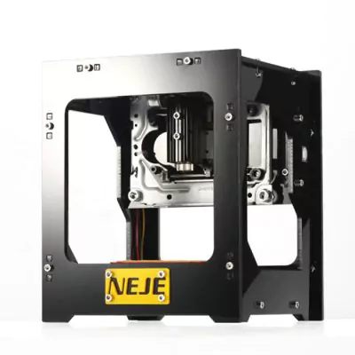

# nejemojo



NeJe NEJE DK-8 Pro-5 500mW Laser Engraver tool. Loads and burns images on your NeJe mini-burner.

# Usage

```

$ nejemojo --help

Usage: nejemojo [OPTIONS] COMMAND [ARGS]...

Options:
  -p, --port TEXT  The serial port  [default: /dev/ttyUSB0]
  --help           Show this message and exit.

Commands:
  box       Draws preview box
  burn      Burn the image
  burntime  Set the pulse burn time, the longer the darker
  erase     Erase image from eeprom
  home      Move to home position
  load      Load the image
  pause     Pause Neje burning
  read      Read from port
  reset     Reset Neje
  view      View the image
```

# TTY settings

baud 57600, 8 data bits, 1 stop bit, parity none


# Engraver protocol

| msg                        | description                                                                              |
| ---                        | ---                                                                                      |
| 0xf9                       | stop/reset                                                                               |
| 0xf1                       | start (Once issued incoming data will specify the position, data uses a modulus format.) |
| 0xf2                       | pause                                                                                    |
| 0xf4                       | engraving preview (visualizes bounding box)                                              |
| 0xf5                       | go up                                                                                    |
| 0xf6                       | go down                                                                                  |
| 0xf7                       | go left                                                                                  |
| 0xf8                       | go right                                                                                 |
| 0xf3                       | go to left corner                                                                        |
| <time in hex default  0x3c | (60ms)> burn time                                                                        |
| 0xfa                       | set motor parameter <hex speed default = 0x23 (35ms)>                                    |
| 0xfb                       | go to center                                                                             |
| 0xfc                       | fast backward <parameter 0x55> fast forward <parameter 0xaa> recarve <parameter 0x77>    |
| 0xfe x8                    | erase + send picture <picture data bmp> (BMP specification Black & White 512x512px)      |

